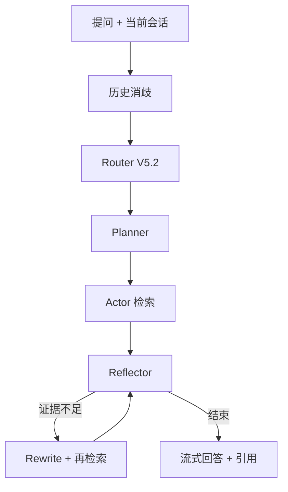

# Agentic RAG Platform

基于 FastAPI、Vue 3、Chroma、Neo4j 和 SQLite 的本地知识库问答项目。提供三种独立模式：Basic RAG、四路 Router V5.2 的 Agentic RAG、以及可调用知识库搜索、联网搜索和报告生成工具的 Tool Agent。当前完成本地代码与离线回归；真实 LLM、Chroma/Neo4j 联调和在线回答评测需在配置好服务与数据后运行。

> 参考了 [Yuxi](https://github.com/xerrors/Yuxi) 等项目的架构思路；本仓库代码独立实现。项目默认单用户，无鉴权，不适合直接对公网开放。

## 功能与链路

| 模式 | 后端接口 | 流程 |
| --- | --- | --- |
| Basic RAG | `POST /api/chat/basic/stream` | 会话消歧 → Chroma 单次检索 → 带文档引用的回答 |
| Agentic RAG | `POST /api/chat/stream` | 会话消歧 → Router V5.2（DIRECT / VECTOR / GRAPH / HYBRID）→ Planner → Actor → Reflector → 必要时改写并重试 → 回答 |
| Tool Agent | `POST /api/agent/chat/stream` | 有界会话历史 → LLM 工具选择 → 参数校验 → 工具执行与错误反馈 → 流式回答 |

上传 `PDF / DOCX / TXT` 时，系统解析并切块，将向量存入 Chroma，抽取的实体关系写入 Neo4j。对话用 SQLite 保存完整成功轮次。Agentic 模式在 Router、检索、判断和改写**实际执行时**发送 SSE 事件，前端显示进行中的步骤；断流或失败不会保存半轮回答。



## 本地运行

需要 Python 3.11、Node 20 和本地 Neo4j。首次 Embedding 加载需要下载 `BAAI/bge-small-zh-v1.5`。分别启动：

```bash
cd backend
python -m venv venv
# Windows PowerShell: .\venv\Scripts\Activate.ps1
# macOS/Linux: source venv/bin/activate
pip install -r requirements.txt
cp .env.example .env
# 编辑 .env：LLM_API_KEY、NEO4J_URI/USER/PASSWORD；SERPER_API_KEY 可选
uvicorn app.main:app --reload --port 8000
```

```bash
cd frontend
npm ci
npm run dev
```

前端 `http://localhost:5173`，API 文档 `http://localhost:8000/docs`。另一种本地启动方式是在项目根目录配置 `.env` 后执行 `docker compose up --build`，前端 `http://localhost`；Compose 会启动 Neo4j，数据保存在卷内。Docker 是本地编排配置，不表示项目已上线。

## 运行与验证

先创建会话，再发送流式请求：

```bash
curl -X POST http://localhost:8000/api/sessions
curl -N -X POST http://localhost:8000/api/chat/stream \
  -H 'Content-Type: application/json' \
  -d '{"session_id":"替换为创建得到的UUID","question":"文档中 Actor 的作用是什么？"}'
```

SSE 使用 `data: {"type":"...","data":...}` 帧。`stage` 为进行中，随后依次可能有 `memory`、`router`、`planner`、`actor`、`reflector`、`rewrite`、`retrieval_info`、`sources`、多帧 `content`、`done`。Tool Agent 另有 `tool_call`、`tool_result`、`file`。服务错误产生 `error`，不会产生成功 `done`。完整字段和时序见 [实现文档](docs/pipeline-memory-evaluation.md)。

离线回归（不调用外部 LLM、Chroma 或 Neo4j）：

```bash
cd backend
python -m pytest -q tests/
cd ../frontend
npm test
npm run build
```

回答评估复用 `backend/evaluation/benchmark.csv` 中 `review_status=ready` 的题。真实运行需要知识库、图谱和 LLM 已就绪；结果写到 git 忽略的 `backend/evaluation/results/`：

```bash
cd backend
python -m evaluation.evaluate_answers --mode live --limit 20
python -m evaluation.evaluate_answers --mode score --predictions evaluation/results/answers/answers.csv
# 可选：调用已配置的模型作参考答案/实际证据判分（产生费用）
python -m evaluation.evaluate_answers --mode live --limit 20 --judge
```

脚本分别报告 route accuracy、来源命中、知识题引用率、拒答/误拒答率、P50/P95 延迟和诊断用关键词召回；`--judge` 才报告回答正确性与证据忠实度，并需人工抽检。**没有运行真实实验时不填写成绩。** Router V5.2 的 Holdout-06 数据和冻结代码保留原样；这个新评估不应被写成 V5.2 的独立 Holdout 成绩。

## 代码与文档

- `backend/app/services/rag_service.py`：Router、检索管线和 SSE 生成。
- `backend/app/services/memory_service.py`、`session_service.py`：追问消歧、有界历史和 SQLite 完整轮次。
- `backend/app/services/agent_service.py`、`agent_tools.py`：工具循环、限制和错误回传。
- `backend/evaluation/evaluate_answers.py`：回答层评估；`backend/tests/` 与 `frontend/tests/`：离线回归。
- [完整设计、接口和限制](docs/pipeline-memory-evaluation.md) · [简历素材及面试口径](docs/resume-material.md) · [后端开发指南](backend/README.md) · [前端开发指南](frontend/README.md)。

## 边界

本项目仅完成本地代码与离线验证，未验证当前环境的 DeepSeek、Serper、Chroma 模型下载或 Neo4j 实例。会话历史用来消歧，不能代替文档/图谱证据；LLM Judge 是辅助指标。单用户 SQLite 和无鉴权接口需在公开部署前补安全与多用户隔离。图谱事实准确性仍取决于抽取质量与原始文档。

MIT License，见 [LICENSE](LICENSE)。
